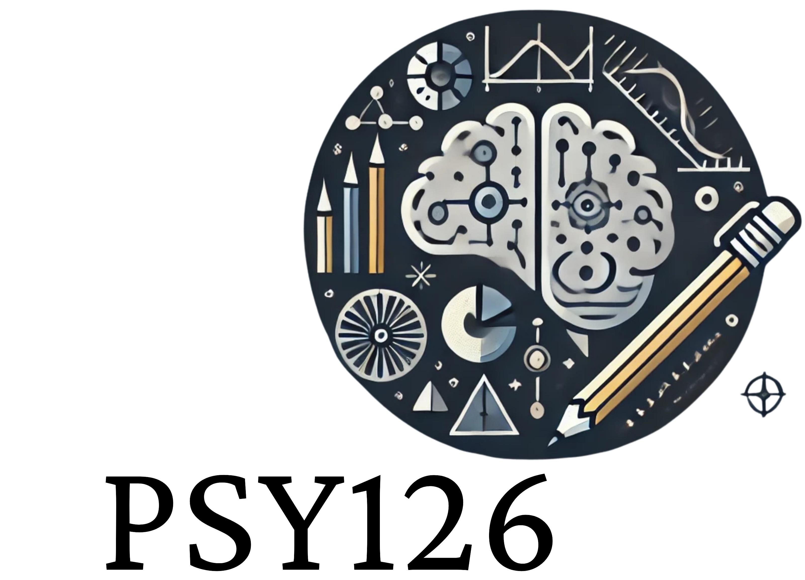

<div style="padding-top:1em; padding-bottom: 0.5em;">


$\ $

</div>

# Test Theory and Test Construction in python

## Online usage (recommended)

Course materials for the psy126 seminar of the Neurocognitive Psychology Master's course at the University of Oldenburg. The content should primarily be accessed from the online book.

If you host your book on GitHub pages, you can add the link to this button: [](https://leonardozaggia.github.io/Psy126-Python/)

## Local usage

Running the book locally requires to first build the book from source:

```batch
cd <path/to/book/>
pip install -r requirements.txt
jb build .
```

This will create the html files in the `_build/` folder. The book can then be used by opening the `_build/html/index.html` file in a browser. The *.ipynb* notebooks for the exercises are located in the `book/` folder and can can either be opened locally or through Google Colab.

## Cloning the repository

If you do not want to download a new version of the book every time, you can leverage GitHub cloning feature.
Open a terminal from your desired IDE.

```batch
cd <path/to/where/you/want/to/save/the/book>
git clone https://github.com/leonardozaggia/psy126.git
```

Make sure that when working on the exercises, you save them on a different folder. In this way your exercise will not be deleated once you update the book using the `git pull` comand from the terminal. As we update the book frequently, please make sure to update the book regularly.

A comprehensive tutorial on how to use git on VS code can be found at this link [](https://www.youtube.com/watch?v=i_23KUAEtUM)
