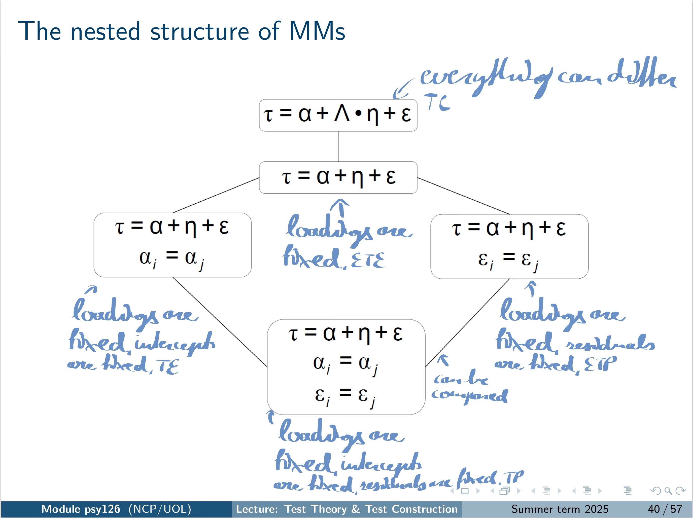

---
jupytext:
  formats: md:myst
  text_representation:
    extension: .md
    format_name: myst
    format_version: 0.13
    jupytext_version: 1.11.5
kernelspec:
  display_name: Python 3
  language: python
  name: python3
---

# <i class="fa-solid fa-chart-line"></i> Quantitative

## Measurement Models for Quantitative Scores

Welcome to today's seminar on measurement models for *quantitative* data.

Today we extend our model selection to data where item scores are not limited to integers. Values may be any real numbers (e.g., 4.5, 4.6, 4.87).

The models we will introduce today can be organised in three families according to increasing restrictiveness:

- **Tau-Congeneric Measurement Models** – freely estimate item difficulty and discrimination parameters, as well as item reliability.
- **(Essentially) Tau-Equivalent Measurement Models** – additionally restrict discrimination (Essentially tau-equivalent) and, in the tau-equivalent case, also fix item difficulty.
- **(Essentially) Tau-Parallel Measurement Models** – additionally constrain discrimination and reliability (Essentially tau-parallel) and, in the tau-parallel model, also equate item difficulty.

### Reminder:
In the lecture we used this slide to get an overview of the different measurement models and their assumptions. Maybe you remember?

