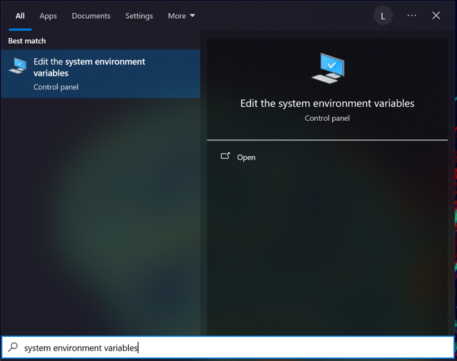
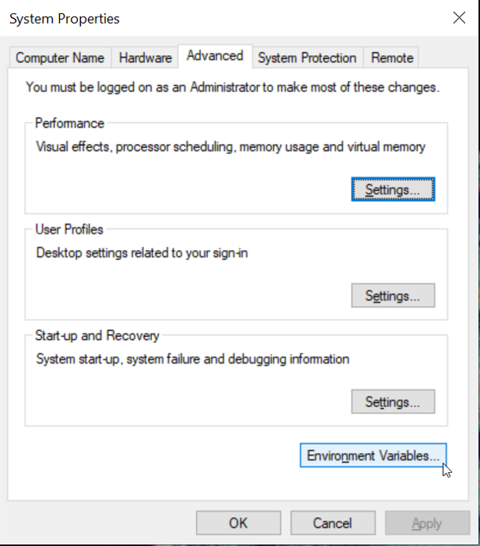
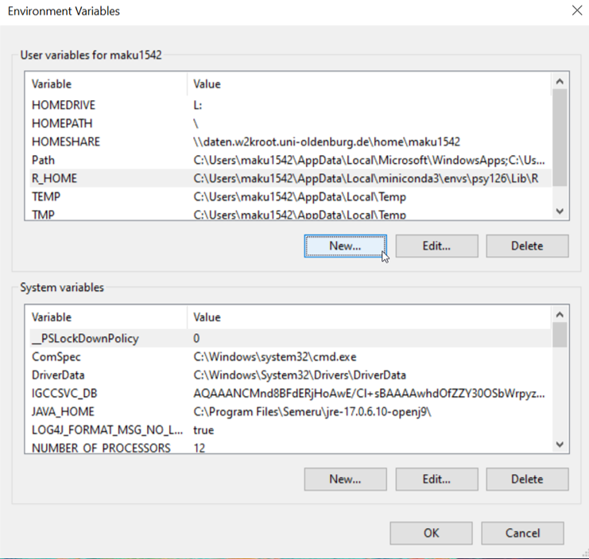
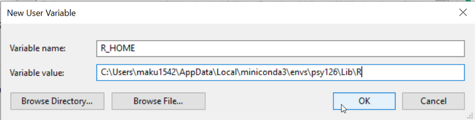

---
jupytext:
  formats: md:myst
  text_representation:
    extension: .md
    format_name: myst
    format_version: 0.13
    jupytext_version: 1.11.5
kernelspec:
  display_name: Python 3
  language: python
  name: python3
---

# 1.1 Installation

For the upcoming semester, we need to use functions from the R programming languae, which we will use within Python through the `rpy2` package.

You should have the following installed from last semester already:

- Anaconda (miniconda)
- Code editor (e.g. Visual Studio code)

If not, please re-visit the installation instructions from the [psy111](https://mibur1.github.io/psy111/book/introduction/1_Setup/0_Introduction.html) module.

As we need many new packages (and even a new programming language) this semester, we start by setting up a new conda environment for the course. 

In the Miniconda prompt (later, we'll see how to access Conda from the VS Code terminal), let's first ensure that we install the necessary dependencies from an up-to-date and reliable source. We’ll do this by adding the conda-forge channel and setting it as the default with strict priority.

```bash
conda config --add channels conda-forge
```
```bash
conda config --set channel_priority strict
```

Now we can create a new Conda environment, which this time not only contains Python but also R:


```bash
conda create -n psy126 python=3.11 r
```
```bash
conda activate psy126
```

If the environment now shows up as `(psy126)`, you are ready to install the required Python packages for the semester:

```bash
pip install matplotlib pandas numpy rpy2==3.5.7 ipykernel statsmodels seaborn
```

Finally, we can install the required R packages.


````{tab-set}
```{tab-item} Windows
~~~bash
R.exe -e "install.packages(c('Gifi', 'mirt', 'future', 'psych', 'MPsychoR', 'polycor', 'lavaan', 'semTools', 'lordif', 'admisc', 'ltm', 'eRm'), repos='https://cran.uni-muenster.de')"
~~~
```

```{tab-item} Linux/MacOS
~~~bash
R -e "install.packages(c('Gifi', 'mirt', 'future', 'psych', 'MPsychoR', 'polycor', 'lavaan', 'semTools', 'lordif', 'admisc', 'ltm', 'eRm'), repos='https://cran.uni-muenster.de')"
~~~
```
````

Once these installations are succesful, you are ready to start.
[Link to the script testing the environment psy126.](https://elearning.uni-oldenburg.de/dispatch.php/course/files/index/fb7cffb2862814204658237b158e2baf?cid=8d69f333772c13bb395a1419339af627)


`````{admonition} 🔧 Potential Issues
:class: warning dropdown

  ## Failing to install the packages?

  If any of the R packages fail to install, you can use the pre-compiled conda packages as a backup. However, please note that they are not the newest version (this should be fine here but could generally lead to errors). This works by using `conda install` and putting an `r-` in front of the package name, all in lower case, e.g.:

  ```bash
  conda install r-mpsychor
  ```

  Alternatively, you can of course always install R packages through e.g. R Studio if you have it installed:

  ```bash
  install.packages(c('Gifi', 'mirt', 'psych', 'MPsychoR', 'polycor', 'admisc', 'ltm', 'eRm'), repos='https://cran.uni-muenster.de')
  ```
  ##  The Kernel crashed?

  Sometimes the miniconda environment is not able to locate the R image to properly import `rpy2`. Therefore, we have to add it to the system paths manually.

  ````{tab-set}
  ```{tab-item} R_HOME
  This is the most likely cause of the kernel crush (us not being able to run owr `rpy2` imports).
  
  Follow the next steps to manually add an R_HOME path to your systhem environment variables.
  ```

  ```{tab-item} Step 1
  ### Locate psy126 R
  To find the R installation inside your `psy126` Conda environment:

  1. Open the **Miniconda Prompt**.
  2. Activate your environment:
    ~~~bash
    conda activate psy126
    ~~~
  3. Run the following command to locate the environment folder:
    ~~~bash
    echo %CONDA_PREFIX%
    ~~~
    This will return something like:
    ~~~
    C:\Users\your_username\AppData\Local\miniconda3\envs\psy126
    ~~~

  4. Inside that folder, you'll find the `R` installation at:
    ~~~
    <conda-env-path>\Lib\R
    ~~~

  📋 **Copy this full path** and add it to your **System Environment Variables** (System > Environment Variables > Edit PATH).

  This allows external tools (like RStudio or Windows terminal) to recognize the R binaries from this environment.

  ```

  ```{tab-item} Step 2
  ### Search for system environment variables 

  
  ```

  ```{tab-item} Step 3
  ### Select `Environment Variables` 

  
  ```

  ```{tab-item} Step 4
  ### Create a new variable
  - If you find a User tab and a System tab, repeat this step twice, once for the **User Variables** and once for the **System Variables**.

  
  ```

  ```{tab-item} Step 5
  ### Insert path to R
  1. Assign to the variable name: **R_HOME**
  2. Assign to the variable value: **previously\found\path\to\envs\psy126\Lib\R**
      - **Note:** make sure you use backslashes

  
  ```

  ````

`````
